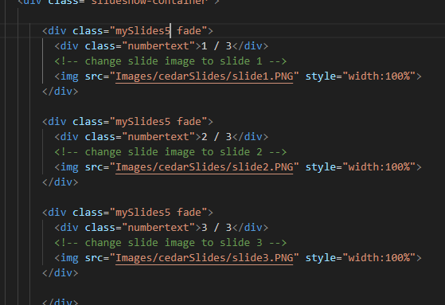
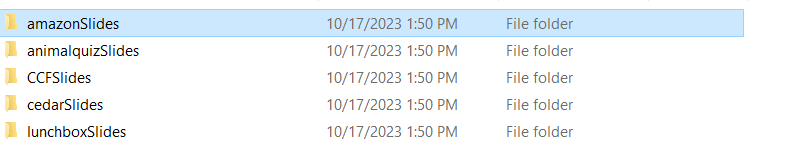

# SICTC Showcase Site (How to add more content)

## Step 1
 - Make sure to download all files in the repo
 - Open up all the files listed (index.html, style.css, script.js)
 - **I will be adding a test site to show you the most informatative way to add a new project (we will be using amazon.com for the example)**

## Step 2
 - Your VSC should look like this currently
 
 - First, take a like at the website 1 code
 
 - There are start & end comments for every website to help you find the locations
 - Let's take a look and understand the code within
 - Each website starts with a section tag and will end with the same section tag
 - We are going to copy the code from section tag to section tag (Like this)
 
 - Then scroll down towards the bottom of the code till you reach the end of the last website (in my instance it's website 4)
 - You want to make sure you are pasting in the right place so make sure you past after the /section tag but above the /div tag above the footer (paste where the cursor is below)
 
 - Now once you have the code pasted in we need to modify it 
 - We need to change things like:
 - Logo
 - Slides
 - Description
 - Anything that indicates the number of the site
 - The website link
 - The button text
 - **I will now guide you through all the steps that need to be done in the HTML**

 ## Step 3: Modification of HTML
 ### Anything that indicates the number of the site
 - First thing we need to change is the section tag and change it to website 5
 
 - Next we need to change the mySlides class to the correct number also
 - We have to change this because later we will modify the JavaScript to run on its own class because we can't have websites running on same JS classes or else the slideshows will crash
  - Make sure to change the number on each slide (you will see in the example I modify it in three areas because there is three slides)
 
 - We also need to change the number for the dots
 - This is necessary for the same reason as the slides 
 
 ### Description
 - Navigate to the description class right below where you modified the dots
 - Delete the content in between the p tags and replace with a proper description of the website you're adding
 
 - What new replaced description should look like
 
### Website Link & Button
- Right below the description you will see the website link and slightly to the right of the link will be the button text
- Simpily change these with the correct information

### Making the Slides
- First things first we need to make a folder to store our slides
- Navigate to the Images folder within the Showcase file
- Then make a new folder called (xxxxxSlides)

- There are other ways to source slides for the showcase, but the way I do it is to go to the website and snip 3 different pages of the website
- Make sure you only include content in the snip DO NOT include the url bar, scroll bar, or the taskbar
- Here is a short video that shows you what I mean

- I recommend saving the slides named (slide1.png/slide2.png) 
- It is simple and easy to navigate 
- We also don't have to worry about naming them the same as another file because they are in their own personal folder
- Once you have all your snips for your slides we need to implement them into the code
- Navigate back to where the slides are in the code and change the image path to where we just made our new folder and put our snips
- Make sure to put the slide numbers in order

 ### Logo
 
  